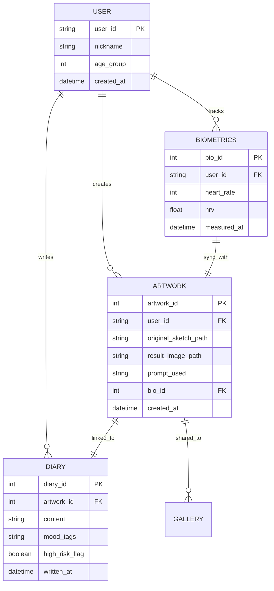

```mermaid
graph LR
    subgraph "Phase 1: 발산 (Expression)"
        Bio["**생체 데이터 (심박수/HRV)**"] --> In1
        Flow1["사용자 스케치"] --> In1["B-H-P 분석 / 감정 단어 선택"]
        In1 --> Proc1["SDXL Adapter Inference"]
        Proc1 --> Out1["예술적 치유 이미지 생성"]
    end

    subgraph "Phase 2: 분석 및 분석 (Analysis)"
        Out1 --> Agent["**전문 분석 에이전트**<br/>(임상적 통찰 제공)"]
        Agent --> Feedback["치유 가이드 및 정서 규제 제안"]
    end

    subgraph "Phase 3: 수렴 및 조절 (Refinement)"
        Feedback --> Flow2["마스킹 (수정 영역 지정)"]
        Flow2 --> In2["10대 핵심 주제 매칭 (희망/치유)"]
        In2 --> Proc2["Kandinsky Inpainting (Object/State 중심)"]
        Proc2 --> Out2["자기 효능감 강화 이미지"]
    end

    subgraph "Phase 4: 기록 및 공유 (Consolidation)"
        Out2 --> Final["개인 갤러리/일기 저장 및 공유"]
        Final --> Loop["바이오-데이터 통합 감정 리포트"]
    end
```

### 상세 단계별 워크플로우

1.  **과정 (Process)**: 초기 대화 및 생체-감정 동기화.
2.  **입력 (Input)**: 캔버스 스케치, 실시간 심박수 데이터, 선택형 프롬프트.
3.  **프로세스 (Process)**: 
    - **Back-end**: PyTorch 기반의 SDXL + ControlNet-Adapter 파이프라인.
    - **Analysis**: 분석 에이전트의 임상 통찰 + Bio-feedback 로직.
4.  **출력 (Output)**: 생성된 예술 작품, 생체 신호 리포트, 그림 일기.
5.  **결과물 (Result)**: 바이오-아트 테라피 리포트, 개인 갤러리, 고위험군 보호 알림.

---

## 2. DB 구조 설계 (Data Schema Design)

### DB 설계 핵심 전략
- **개인정보 보호**: 모든 이미지는 로컬 암호화 경로에 저장되며, 외부 공유 시에만 익명화된 토큰으로 서버 통신.
- **안전 추적**: `DIARY` 테이블의 `high_risk_flag`를 자동 업데이트하여 고위험군 관리 연동.
- **치료 효율성**: `ARTWORK` 테이블에 `adapter_scale` 값을 기록하여 환자가 선호하는 스케치 준수율 통계 분석.

---
**마인드팔레트 기술팀 (DB & System Architect)**
