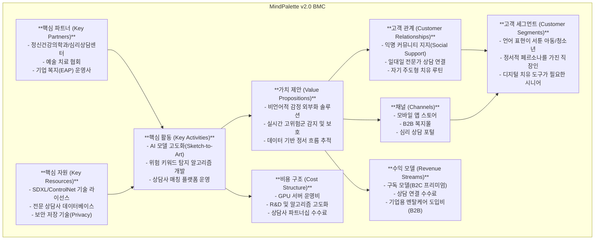

# 🚀 MindPalette v2.0: Business Strategy & BMC

## 1. 정교화된 서비스 타겟 (Target Audience)
논문([SDS24](https://arxiv.org/))의 가치인 **'비언어적 외부화'**를 극대화하기 위해 타겟을 명확히 합니다.

- **핵심 타겟**: **"언어적 소통에 장벽이 있는 정서 케어 필요군"**
    - **A그룹 (발달/인지)**: 감정 어휘가 부족한 아동·청소년 및 인지 저하를 겪는 시니어.
    - **B그룹 (급성 스트레스)**: 사회적 가면(Linda 사례)을 쓰고 있지만 내면은 'Chaos' 상태인, 즉각적인 감정 배출이 필요한 성인.
- **선정 사유**: 말로 표현하기 힘든 고통을 AI가 보존된 스케치(Sketch Integrity)를 통해 예술로 치환해줄 때 가장 큰 치료적 카타르시스를 느낌.

## 2. 비즈니스 모델 캔버스 (Business Model Canvas)

## 3. 플랫폼 확장 및 안전 기능 (Safety & Features)

### 🛡️ 마음 보호 필터 (Safety Filter)
- **위험 감지**: 그림 일기/프롬프트 내 '자살', '자해', '살해' 등 고위험 키워드 및 시각적 패턴 감지 시 자동 작동.
- **즉각 대응**: 
    1. 해당 게시물/일기 즉시 **자동 비공개** 처리.
    2. 사용자에게 **"지금 마음이 많이 힘드신가요? 전문가의 도움이 필요할 것 같아요"** 팝업 노출.
    3. 즉시 연결 가능한 24시간 상담 센터 번호 및 파트너 상담사 연결 버튼 활성화.

### 🤝 전문가 연결 (Professional Referral)
- **상담사 매칭**: 작품의 지배적인 색상/무드 데이터를 익명화하여 상담사에게 전달, 사용자의 정서 상태에 최적화된 상담사 추천.
- **예약 연동**: 앱 내에서 바로 상담 예약 및 비대면 상담(화상/채팅) 지원.

### 갤러리 연령별 공유 설정
- **연령 그룹화**: 아동/청소년/성인/시니어별 갤러리 섹션 분리.
- **공개 범위**: 자신의 작품 공유 시 노출 타겟 연령대(예: '중학생 그룹에만 공유') 선택 가능.

## 4. 시장성 및 차별성 (Economic Value)
- **독보적 기술**: 일반 AI 앱이 '예쁜 결과'에 치중할 때, 마인드팔레트는 **사용자의 '진짜 선'을 보존**하여 치료적 효용성을 확보함.
- **시장 확장성**: 연평균 18% 성장하는 디지털 멘탈헬스 시장 내에서 '비언어적 치료' 분야의 선점자(First Mover) 효과.

---
**마인드팔레트 전략기획팀 (Antigravity AI)**
